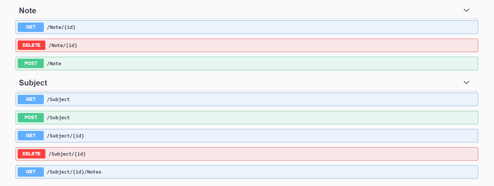
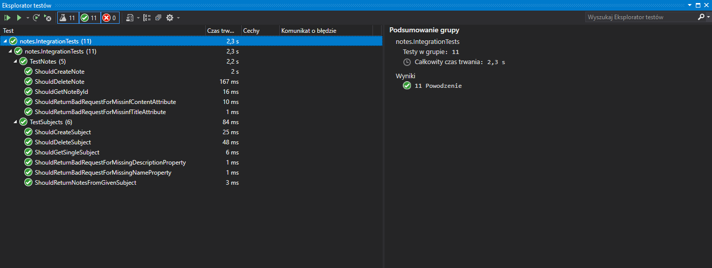
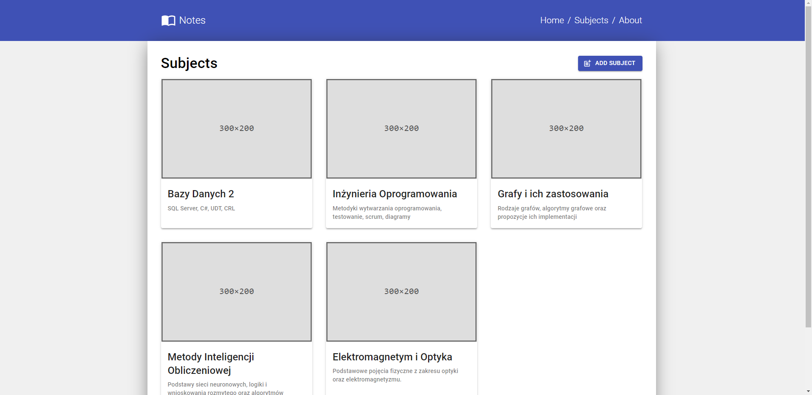
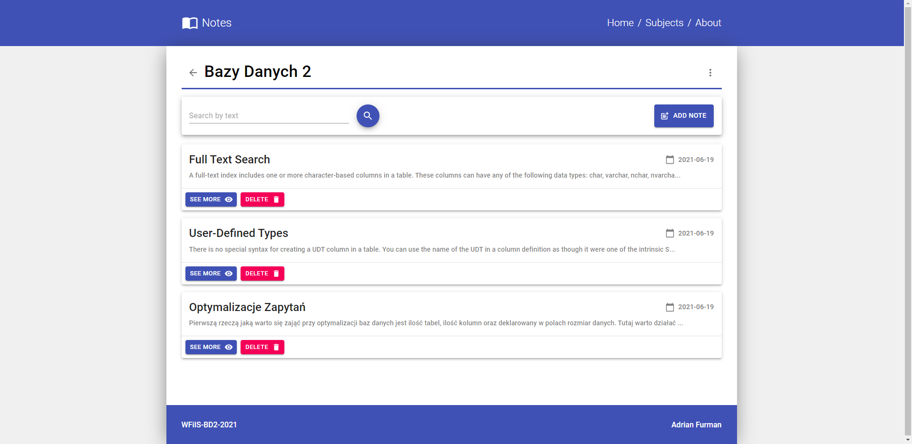
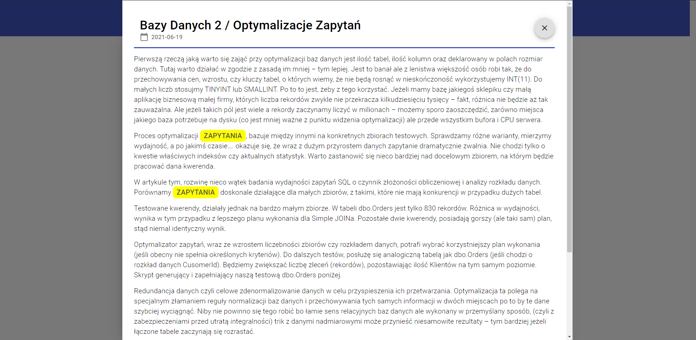
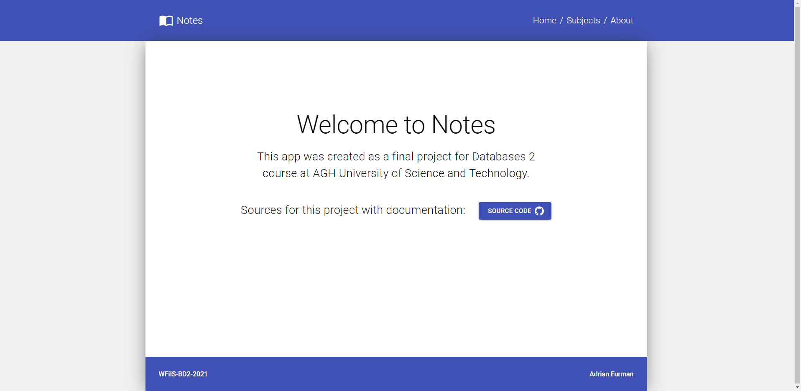
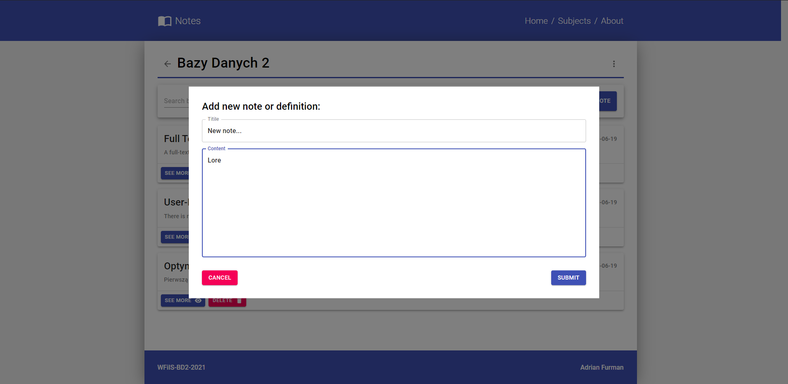

# Notes - Dokumentacja projektu zaliczeniowego z przedmiotu Bazy Danch 2

## 1. Opis projektu

### Temat:
> Przetwarzanie danych typu CLOB. Opracować API i jego implementację do przetwarzania danych typu CLOB. W ramach projektu można wykorzystać typ danych CLOB oraz technologię wyszukiwania pełnotekstowe FTS. Opracowane API powinno umożliwić zapis i usunięcie wybranego dokumentu oraz wyszukanie określonej informacji w dokumentach umieszczonych w repozytorium.

### Propozycja rozwiązania:

> Notes - Aplikacja webowa służąca do zarządzania i przeglądnaia notatek, które są pogrupowane na różne przedmioty. REST API udostępnia operacje do zarządzania przedmiotami oraz notatkami. Opcja wyszukiwania notatek zawierających zadaną frazę (FTS).

### DEMO APLIKACJI => [LINK](https://fadikk367.github.io/Notes-client)*
### **UWAGA !!!**
*Z racji darmowego hostingu na Azure, backend aplikacji potrzebuje chwili na rozruch po okresie uśpienia więc przy pierwszym wejściu należy chwilę poczekać na załadowanie danych.*

## 2. Endpointy i typy danych

Poniższe zdjęcie pochodzące z narzędzia go automatycznego generowania dokumentuji do API - Swagger - przedstawia endpointy wystawione przez serwer:



Dane zwracane w zapytaniach typu GET kształtują się zgodnie ze zdefiniowanymi w projekcie klasami, zaprezentowanymi w uproszczeniu na zdjęciu poniżej. W przypadku endpointów zakończonych parametrem *{id}* zwracane są pojedyncze obiekty odpowiedniego typu a w przypadku zapytań GET o ogólnej formie np. */Subject* lub */Subject/{id}/Notes* zwracane są listy obiektów.

```c#
class Subject {
  int Id;
  string Name;
  string Description;
}

class Note {
  int Id;
  string Title;
  string Content;
  DateTime CreatedAt;
  int SubjectId;
}
```

Przedstawione powyżej klasy określające typy danych, są automatycznie mapowane na tabele w bazie danych dzięki uprzejmości frameworka *Entity Framework*.

Jeśli chodzi o dane oczekiwane w zapytaniach typu POST opisane są przez specjalne klasy DTO (Data Transfer Object):

```c#
class SubjectDTO {
  string Name;
  string Description;
}

class NoteDTO {
  string Title;
  string Content;
  int SubjectId;
}
```

## 3. Opis implementacji

### 3.2 Baza Danych

Wykorzystaną bazą danych jest oczywiście SQL Server 2019. Z racji specyfiki wybranego tematu projektu niezbędne jest rownież doinstalowanie dodatkowej usługi *Full-Text Search*.

W strukturze bazy danych występują jedynie dwie tabele: Subjects oraz Notes, połączone relacją jeden do wielu.

Full-Text Index utworzony został dla kolumny *Content* tabeli Notes, która przechowuje właściwe treści przechowywanych notatek czy definicji, które mogą osiągać znaczne rozmiary.

### 3.2 Serwer

Serwerowa część apliakcji zaimplementowała została w technologii ASP.NET Core 5.0 jako REST API. Struktura projetu jest typowa dla tego rodzaju aplikacji - występuje podział na kontrolery, które odpowiadają za routing i obsługę zapytań na najwyższym poziomie abstrakcji i realizują zadane fragmenty API (np. opracje na notatkach czy przedmiotach)

Operacje na bazie danych, a dokładnie na jej kontekście (DbContext) wykonywane są z poziomu repozytoriów, które obsługują konkretne rodzaje zapytań i są wykorzystywane w kontrolerach.

Jako że projekt jest bardzo mały, podjęto decyzję aby nie wprowadzać dodatkowej warstwy abstrakcji pomiędzy kontrolerami a repozytoriami (serwisy).

> [Repozytorium z kodem serwera](https://github.com/Fadikk367/Notes-server)

### 3.3 Klient

Jako klienta stworzonego API webowgo zaproponowano prosty prototyp aplikacji webowej napisany przy użyciu biblioteki *React*. Aplikacja posiada jedynie trzy widoki: główny - prezentujący dostępne przedmioty, widok konkretnego przedmiotu z widoczynmi odnoszącymi się do niego notatkami oraz informacyjny - zawierajacy podstawowe informacje o aplikacji oraz linki.

> [Repozytorium z kodem klienta](https://github.com/Fadikk367/Notes-client)

##  4. Testy

Z racji tworzenia w ramach projektu API webowego typu REST skupiono się na testach integracyjnych, testujących działanie dostępnych endpointów. Poniżej zamieszczony został screen shot z rezultatem uruchomienia testów serwerowej części projektu:




## 5. Interfejs Aplikacji


Strona główa, przedstawiająca dostepne przedmioty, do których przypisane są poszczególne notatki:



Strona konkretnego przedmiotu z listą notatek oraz polem do wyszukiwania tekstowego na zawartości notatek:



Widok konkretnej notatki, z zaznaczonymi wystąpieniami szukanej frazy (o ile została ona podana):



Podstrona informacyjna:



Forumlarz do dodawania notatek:



## 6. Lokalne uruchomienie projektu

### 6.1 Serwer

Wymagania: 
* Visual Studio 2019 ze wsparciem dla .NET 5.0
* MSSQL Server 2019 z zainstalowanym dodatkem do obsługi Full-Text Search

Instrukcje:
1. Sklonować repozytorium z kodem źródłowym:
```
$ git clone https://github.com/Fadikk367/Notes-server.git
```
2. Uruchomić skrypty sql z katalogu */sql* w podanej kolejności w celu utworzenia bazy danych wraz z niezbędną strukturą oraz przykładowymi danymi

3. Uruchomić projekt w środowisku Visual Studio 2019

API zostanie wystawione pod adresem:
```
http://localhost:28410
```

### 6.2 Klient

Wymagania: 
* Node.js v14+

Instrukcje:
1. Sklonować repozytorium z kodem źródłowym:
```
$ git clone https://github.com/Fadikk367/Notes-client.git
```
2. Z poziomu katalogu głównego wywołać komendę:
```
$ npm install
```

3. Następnie:
```
$ npm start
```

Aplikacja zostanie uruchomiona na lokalnym porcie 3000:
```
http://localhost:28410
```
## 7. Podsumowanie

Technologia Full-Text Search pozwala na wydajne przeszukiwanie danych tekstowych (w tym CLOB) pod kątem występowania danych słów czy fraz. W porównaniu do operatora LIKE, FTS wypada znacznie lepiej, tymbardziej jeśli mamy do czynienia ze znacznymi ilościami rekordów zawierających dane tekstowe. Aby móc wdrożyć tą technologię do swojej bazy danych należy zadbać o instalację dodatkowego komponentu FullText Search.

W zaprezentowanej aplikacji FTS została wykorzystana w celu przeszukiwania dostępnych notatek pod kątem pożądanych słów kluczowych czy nawet występowania całych fraz.

## 8. Źródła
 * [Dokumentacja ASP.NET](https://docs.microsoft.com/pl-pl/aspnet/core/?view=aspnetcore-5.0)
 * [MSSQL Server 2019](https://www.microsoft.com/pl-pl/sql-server/sql-server-2019)
 * [Technologia Full-Text Search](https://docs.microsoft.com/en-us/sql/relational-databases/search/full-text-search?view=sql-server-ver15)
 * [Wdrażanie aplikacji ASP.NET na platformie Azure](https://docs.microsoft.com/pl-pl/azure/app-service/app-service-web-tutorial-dotnet-sqldatabase)
 * [React](https://pl.reactjs.org/)
 * [Material-UI](https://material-ui.com/)
 * [React Query](https://react-query.tanstack.com/)
